# 架构图与流程图

本文档包含 OpenClaw Mission Control 的所有 Mermaid 图表源代码。在支持 Mermaid 的 Markdown 渲染器中查看可自动渲染为图形。

---

## 1. 系统架构图

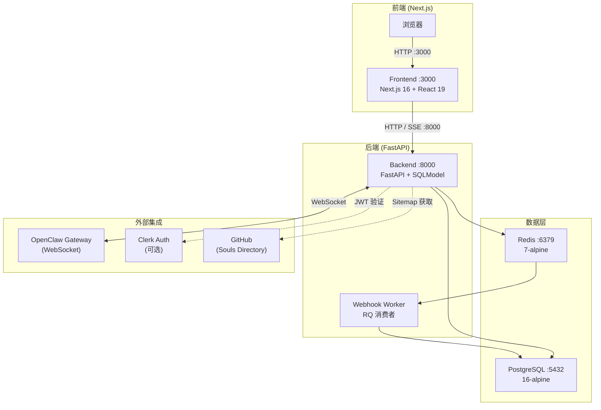

## 2. 数据模型 ER 图

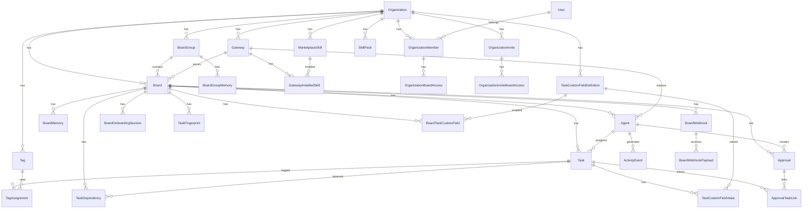

## 3. 请求处理流程

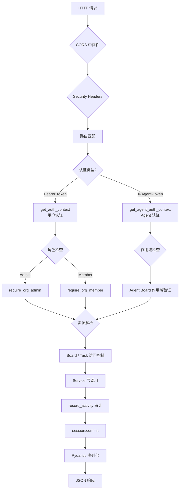

## 4. 认证流程图

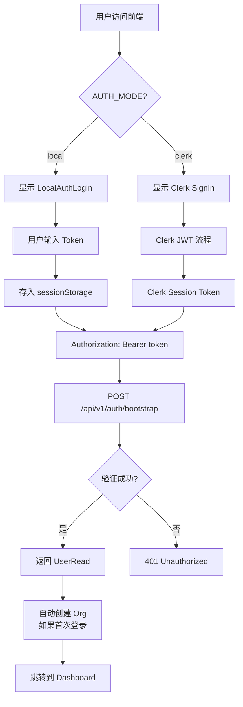

## 5. 任务状态流转图

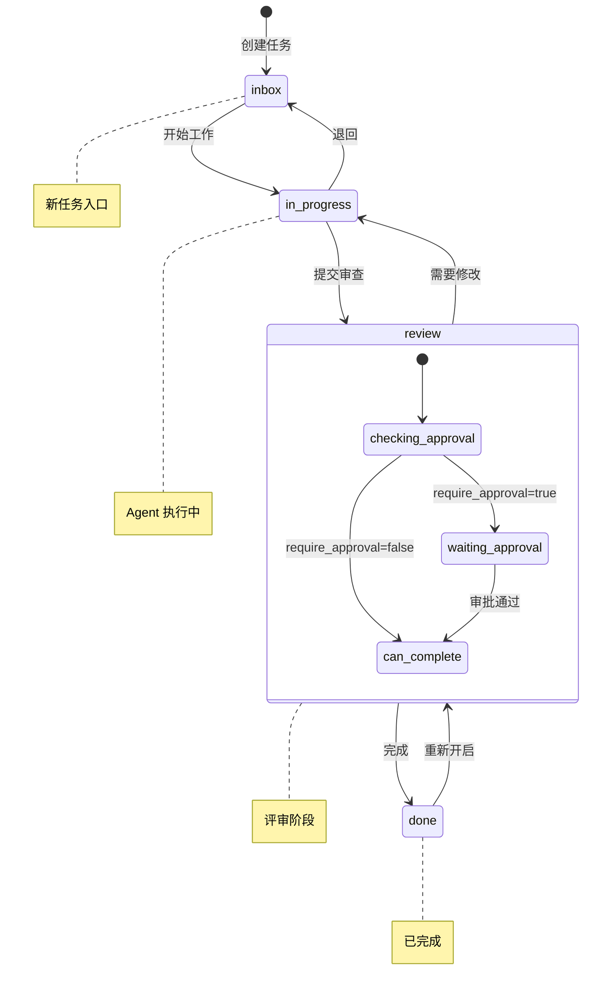

## 6. 审批工作流

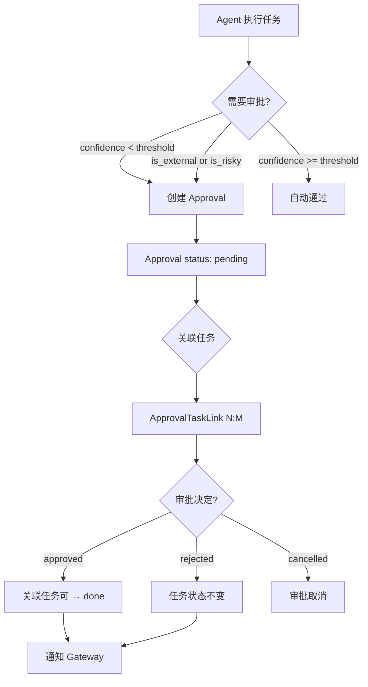

## 7. Agent 生命周期

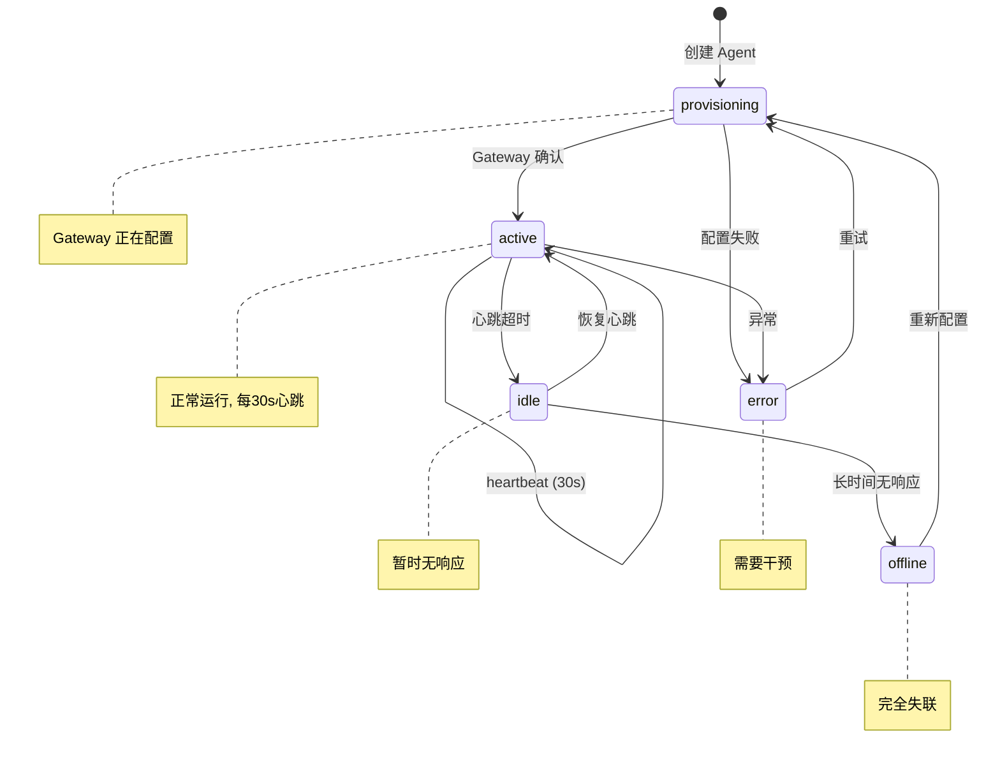

## 8. Webhook 处理流程

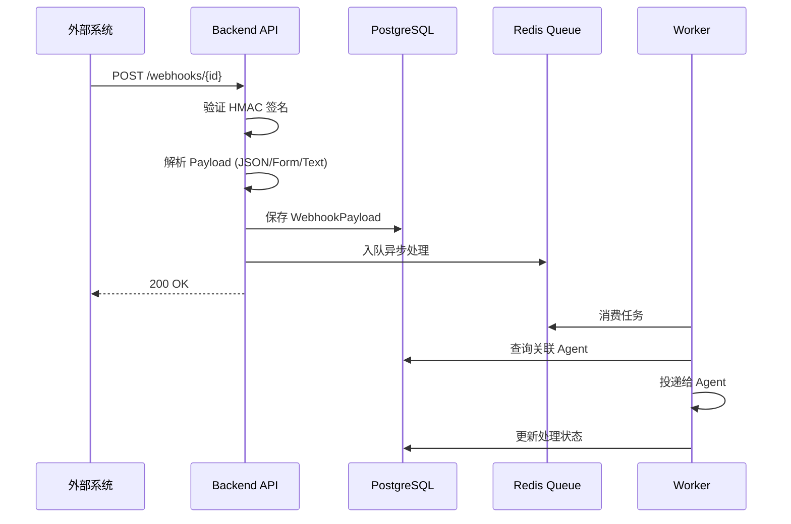

## 9. Board 引导流程

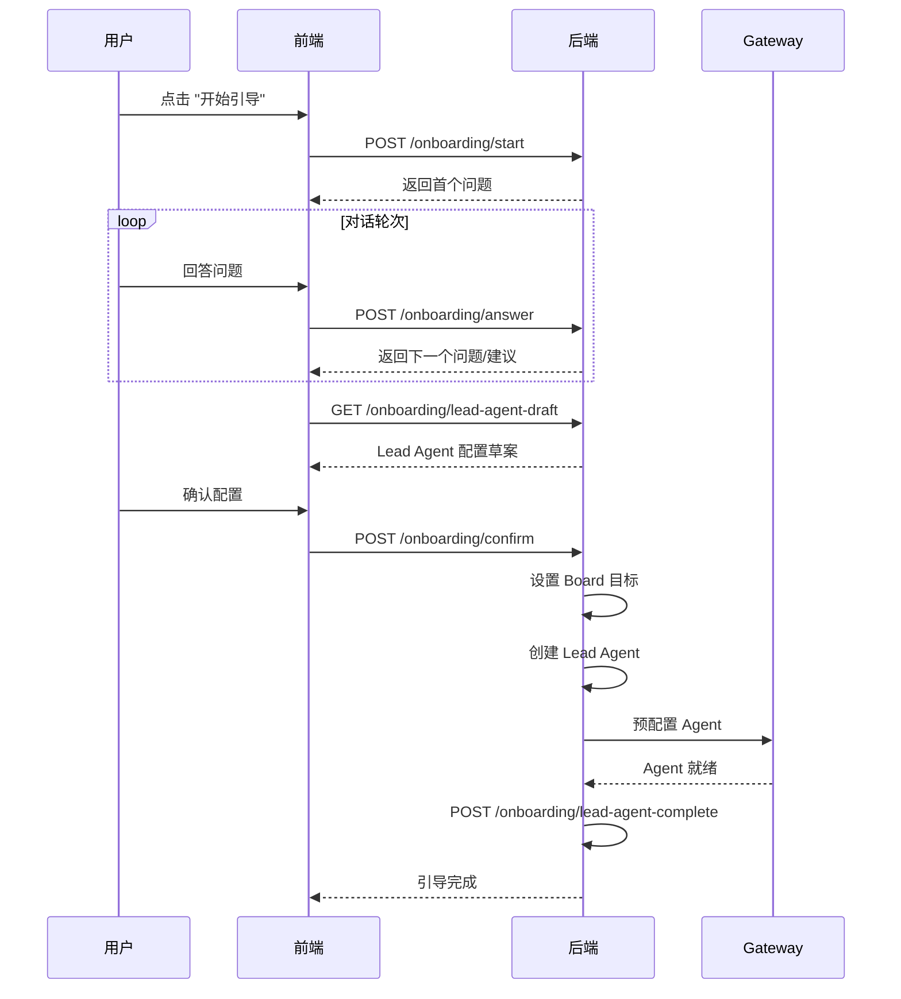

## 10. SSE 实时推送架构

```mermaid
flowchart LR
    subgraph "前端 (Activity Page)"
        C1[Board 1 Task Stream]
        C2[Board 1 Approval Stream]
        C3[Board 1 Memory Stream]
        C4[Board 2 Task Stream]
        C5[Agent Stream]
        Merge[事件聚合<br/>去重 + 排序<br/>最大 300 条]
        UI[Activity Feed UI]
    end

    subgraph "后端 SSE 端点"
        S1[/tasks/stream]
        S2[/approvals/stream]
        S3[/memory/stream]
        S4[/agents/stream]
    end

    subgraph "数据库轮询"
        DB[(PostgreSQL)]
    end

    DB --> S1
    DB --> S2
    DB --> S3
    DB --> S4

    S1 -->|SSE| C1
    S2 -->|SSE| C2
    S3 -->|SSE| C3
    S1 -->|SSE| C4
    S4 -->|SSE| C5

    C1 --> Merge
    C2 --> Merge
    C3 --> Merge
    C4 --> Merge
    C5 --> Merge
    Merge --> UI
```

## 11. 多租户访问控制

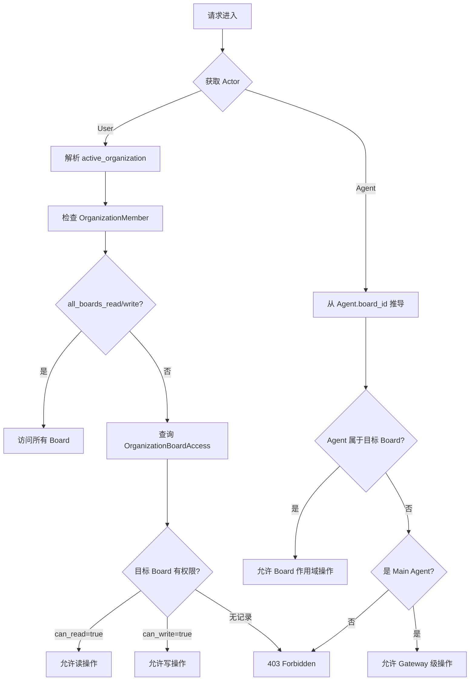

## 12. 网关与Agent编排

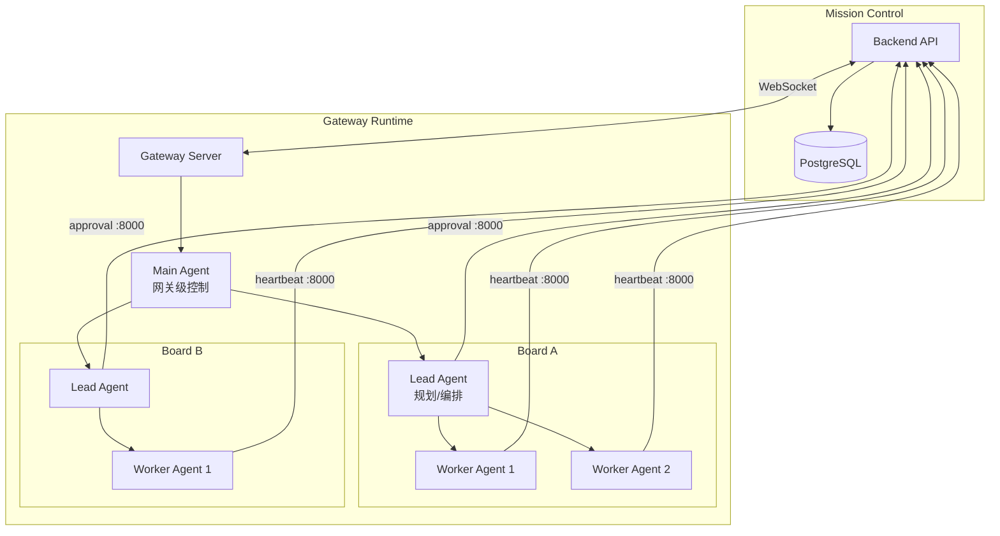
